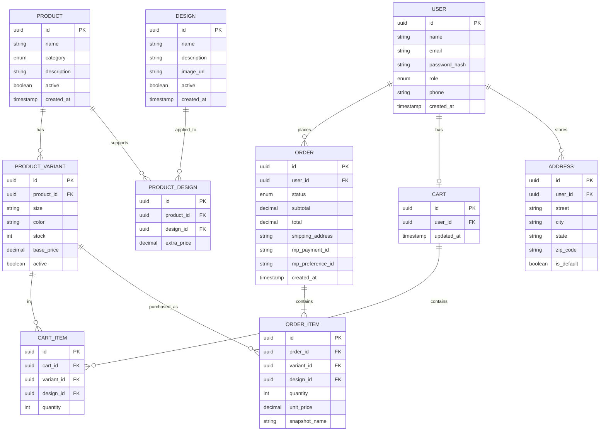

# Ecommerce — Productos Personalizados
## Contexto del negocio
Tienda online de productos personalizados (tazas, playeras, hoodies, totes, fundas).
El cliente elige un diseño de un catálogo fijo y lo aplica al producto de su elección.
Pasarela de pagos: MercadoPago.

## Stack
NestJS · TypeScript · PostgreSQL · TypeORM · JWT · Swagger · Docker · Cloudinary · MercadoPago · GitHub Actions · Deploy en Render

## Roles
- `ADMIN` — gestiona productos, diseños, órdenes y reportes
- `CLIENT` — navega catálogo, agrega al carrito, realiza órdenes

## Entidades

### USER
| Campo | Tipo |
|-------|------|
| id | uuid PK |
| name | string |
| email | string |
| password_hash | string |
| role | enum (ADMIN, CLIENT) |
| phone | string |
| created_at | timestamp |

### PRODUCT
| Campo | Tipo |
|-------|------|
| id | uuid PK |
| name | string |
| category | enum (TAZA, PLAYERA, HOODIE, OTRO) |
| description | string |
| active | boolean |
| created_at | timestamp |

### PRODUCT_VARIANT
| Campo | Tipo |
|-------|------|
| id | uuid PK |
| product_id | uuid FK |
| size | string |
| color | string |
| stock | int |
| base_price | decimal |
| active | boolean |

### DESIGN
| Campo | Tipo |
|-------|------|
| id | uuid PK |
| name | string |
| description | string |
| image_url | string (Cloudinary) |
| active | boolean |
| created_at | timestamp |

### PRODUCT_DESIGN (tabla pivote)
| Campo | Tipo |
|-------|------|
| id | uuid PK |
| product_id | uuid FK |
| design_id | uuid FK |
| extra_price | decimal |

> Permite que un diseño tenga precio extra diferente según el producto al que se aplica.

### CART
| Campo | Tipo |
|-------|------|
| id | uuid PK |
| user_id | uuid FK |
| updated_at | timestamp |

### CART_ITEM
| Campo | Tipo |
|-------|------|
| id | uuid PK |
| cart_id | uuid FK |
| variant_id | uuid FK |
| design_id | uuid FK |
| quantity | int |

### ORDER
| Campo | Tipo |
|-------|------|
| id | uuid PK |
| user_id | uuid FK |
| status | enum (PENDING, PAID, PROCESSING, SHIPPED, DELIVERED, CANCELLED) |
| subtotal | decimal |
| total | decimal |
| shipping_address | string |
| mp_payment_id | string |
| mp_preference_id | string |
| created_at | timestamp |

> `mp_preference_id` se genera al crear la orden. `mp_payment_id` llega por webhook cuando el cliente paga.

### ORDER_ITEM
| Campo | Tipo |
|-------|------|
| id | uuid PK |
| order_id | uuid FK |
| variant_id | uuid FK |
| design_id | uuid FK |
| quantity | int |
| unit_price | decimal |
| snapshot_name | string |

> `snapshot_name` guarda el nombre del producto al momento de la compra para preservar el historial aunque el producto cambie de nombre después.

### ADDRESS
| Campo | Tipo |
|-------|------|
| id | uuid PK |
| user_id | uuid FK |
| street | string |
| city | string |
| state | string |
| zip_code | string |
| is_default | boolean |

## Relaciones
- USER → ORDER (1:N)
- USER → CART (1:1)
- USER → ADDRESS (1:N)
- PRODUCT → PRODUCT_VARIANT (1:N)
- PRODUCT → PRODUCT_DESIGN (1:N)
- DESIGN → PRODUCT_DESIGN (1:N)
- CART → CART_ITEM (1:N)
- PRODUCT_VARIANT → CART_ITEM (1:N)
- ORDER → ORDER_ITEM (1:N)
- PRODUCT_VARIANT → ORDER_ITEM (1:N)

## Módulos NestJS

| Módulo | Responsabilidad | Color |
|--------|----------------|-------|
| Auth | JWT, Guards, Roles | Morado |
| Users | Registro, perfil, direcciones | Morado |
| Products | Catálogo, variantes, categorías | Teal |
| Designs | Catálogo de diseños, upload Cloudinary | Teal |
| Cart | Carrito, items, cálculo de totales | Coral |
| Orders | Flujo de orden, estados, items | Coral |
| Payments | MercadoPago, preferencias, webhook | Coral |
| Notifications | Emails de confirmación | Gris |
| Admin | Dashboard, reportes, gestión | Gris |
| Storage | Cloudinary, manejo de archivos | Gris |
| Database | TypeORM, PostgreSQL | Gris |
| Common | DTOs, Pipes, Guards, Decorators | Gris |

## Fases

### Fase 1 — Core del catálogo
- [ ] Setup del repo (monorepo: apps/api, apps/web futuro)
- [ ] Auth con JWT y roles (ADMIN, CLIENT)
- [ ] Módulo Users
- [ ] Módulo Products + Variants
- [ ] Módulo Designs + integración Cloudinary
- [ ] Swagger documentado

### Fase 2 — Flujo de compra
- [ ] Módulo Cart
- [ ] Módulo Orders
- [ ] Módulo Payments con MercadoPago
- [ ] Webhook de confirmación de pago
- [ ] Actualización de stock al confirmar orden

### Fase 3 — Operación
- [ ] Notificaciones por email (confirmación de orden)
- [ ] Panel Admin con reportes básicos
- [ ] Gestión de stock desde Admin
- [ ] Exportación de órdenes

## Estructura del repositorio
```
ecommerce-api/
├── apps/
│   ├── api/          ← NestJS (backend)
│   └── web/          ← Next.js (frontend — fase futura)
├── packages/
│   └── shared/       ← tipos compartidos
├── docker-compose.yml
├── DESIGN.md         ← este archivo
└── README.md
```

## Flujo Git
```
main → develop → feature/[modulo]
```

## Servicios externos
| Servicio | Uso |
|----------|-----|
| MercadoPago | Pasarela de pagos — preferencias y webhook |
| Cloudinary | Almacenamiento de imágenes de diseños |
| Render | Deploy del backend |
| GitHub Actions | CI/CD |

## Flujo de pago con MercadoPago
1. Cliente confirma orden → backend crea `mp_preference_id`
2. Cliente es redirigido a MercadoPago
3. Cliente paga → MercadoPago llama al webhook
4. Webhook actualiza `ORDER.status` a PAID y guarda `mp_payment_id`
5. Se dispara notificación por email al cliente

## ERD en Mermaid (para importar en diagrams.net)

